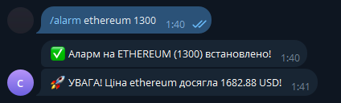
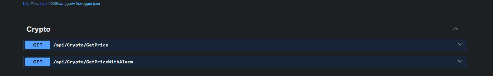

Crypto Monitoring API & Telegram Bot
Це бекенд-сервіс для автоматизованого відстеження криптовалют. Система побудована з акцентом на модульність, масштабованість та стабільність фонових процесів, що дозволяє легко інтегрувати її у власні проєкти.

Архітектура та стек
Runtime: .NET 10.
Архітектурний підхід: Onion Architecture. Логіка чітко розділена на шари: Domain (моделі), Application (бізнес-логіка, команди), Infrastructure (зовнішні API, БД), API (контролери).
CQRS & MediatR: Всі запити та команди обробляються через паттерн CQRS за допомогою бібліотеки MediatR. Це дозволяє розмежувати операції читання та запису, роблячи код чистим і легким для підтримки.
Background Processing: Hangfire. Відповідає за планування та гарантоване виконання повторюваних завдань за CRON-виразами.
Caching: Redis. Використовується як розподілене сховище для кешування даних та як надійний бекенд для зберігання стану завдань Hangfire.
HTTP Resilience: Polly. Для обробки помилок при запитах до зовнішніх API (Retry, Circuit Breaker).
Communication: Інтеграція з Telegram Bot API для миттєвої доставки сповіщень про зміну ціни активів.
Containerization: Docker Compose.

Суть роботи
Система отримує дані про вартість криптовалют, аналізує їх згідно із заданими параметрами та, у разі спрацювання тригера, формує повідомлення, яке через Telegram-бота відправляється в обраний чат. Фонові процеси,
що керуються Hangfire, забезпечують регулярне опитування ринку незалежно від стану HTTP-запитів до API.

Запуск проєкту
Для розгортання системи достатньо локально встановленого Docker.
Склонуйте репозиторій(-b main) та перейдіть у кореневу папку.
Створіть файл .env на основі .env.example та вкажіть свої ключі: TelegramBot__Token, ChatId, CryptoApiSettings__CryptoApiKey . Так само з файлом appsettings.json
Запустіть інфраструктуру командою: docker-compose up -d --build.
Система автоматично налаштує мережу між контейнерами, запустить API та Redis. Після запуску сервіси будуть доступні:
API (Swagger UI): http://localhost:5000/swagger
Hangfire Dashboard: http://localhost:5000/hangfire

Для зупинки системи виконайте docker-compose down.

Сервіс можна використовувати як автономний інструмент для автоматизації: достатньо створити власного бота через BotFather, отримати Token та Chat ID, і прописати їх у конфіг. Це дозволяє розгорнути персоналізовану систему моніторингу для будь-яких задач.
Буде дуже корисний для тих хто торгує на фючерсах.

Приклад використання з телеграм бота:

Свагер:

